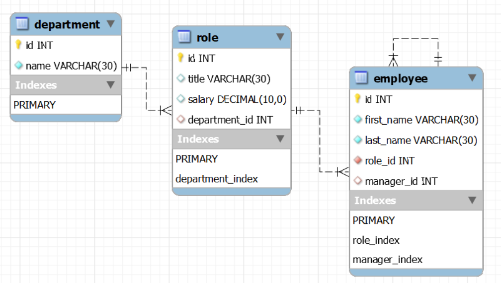

# 12 SQL: Employee Tracker

## Table of Contents

- [Description](#description)
- [Installation](#installation)
- [Usage](#usage)
- [Schema Diagram](#schema-diagram)
- [Walkthrough](#walkthrough)
- [Contact](#contact)

## Description

An app to view, add and update information about departments, roles and employees.

## Installation

Fork it, clone it, from the terminal type and enter 'npm i' to install the Inquirer, MySQL2 and console.table node packages.

## Usage

In the terminal, from the root folder, run with command "npm start". Then navigate through the options with the up and down buttons.

## Schema Diagram

## Walkthrough

[Click me to open video link](https://www.dropbox.com/s/jlw1qvoy84nx9ro/12-EmployeeTracker.mp4?dl=0)

## Contact

Mehalet KesateBirhan  
Github: https://github.com/MehaletKB 
email: tatybcoding@gmail.com
